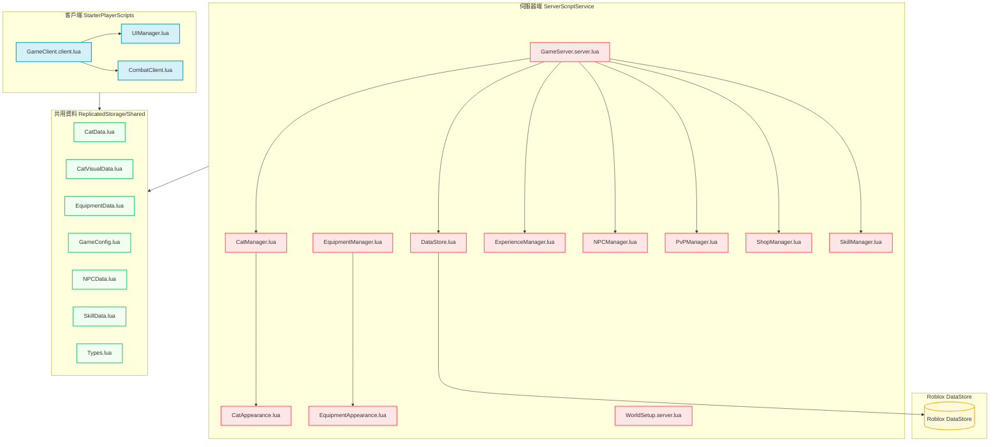

# Roblox Cat Battle — 專案心智圖譜 (Project Mindmap)

此文件梳理了整個 **Roblox Cat Battle** 專案的系統架構、元件關係與邏輯流程，協助快速掌握專案開發重點。

---

## 視覺化系統架構 (Mermaid 關係圖)



---

## 核心系統剖析

### 1. 角色與外觀系統 (Character & Appearance)
- **職責**：將玩家角色替換為高品質的 3D 貓咪形象，並動態載入武器、帽子與項圈配件。
- **關鍵檔案**：
  - [CatAppearance.lua](file:///Users/seasu.wang/Downloads/Projects/Roblox-Cat-Battle-main/src/server/CatAppearance.lua)：負責貓咪身體（Suit）、頭套（Hood）與尾巴（Tail）的加載與 R15 骨架透明化。
  - [EquipmentAppearance.lua](file:///Users/seasu.wang/Downloads/Projects/Roblox-Cat-Battle-main/src/server/EquipmentAppearance.lua)：負責玩家武器與裝備的實體掛載。
  - [CatVisualData.lua](file:///Users/seasu.wang/Downloads/Projects/Roblox-Cat-Battle-main/src/shared/CatVisualData.lua)：定義每隻貓咪的配色、Mesh ID 與貼圖。
- **技術細節**：
  - 角色使用 R15 透明素體作為骨架基礎。
  - 透過 `InsertService:LoadAsset` 下載模型，並自動將 `MeshPart` 轉換成 `Accessory`。
  - 當權限不足或載入失敗時，備有「原始 Mesh ID 模式」及「Weld 貼合模式」等相容方案。

### 2. 戰鬥與技能系統 (Combat & Skills)
- **職責**：處理點擊攻擊、技能施放、CD 冷卻、碰撞檢測與傷害顯示。
- **關鍵檔案**：
  - [CombatClient.lua](file:///Users/seasu.wang/Downloads/Projects/Roblox-Cat-Battle-main/src/client/CombatClient.lua)：客戶端射線偵測（Raycasting）與武器揮擊動畫（多關節三段式）。
  - [SkillManager.lua](file:///Users/seasu.wang/Downloads/Projects/Roblox-Cat-Battle-main/src/server/SkillManager.lua)：伺服器端技能邏輯、冷卻時間校驗、範圍傷害判定。
  - [SkillData.lua](file:///Users/seasu.wang/Downloads/Projects/Roblox-Cat-Battle-main/src/shared/SkillData.lua)：技能數值與解鎖等級配置。

### 3. 玩家資料與成長系統 (Player Progress)
- **職責**：管理玩家的經驗值（XP）、等級（Level）、金幣、解鎖貓咪與裝備背包。
- **關鍵檔案**：
  - [DataStore.lua](file:///Users/seasu.wang/Downloads/Projects/Roblox-Cat-Battle-main/src/server/DataStore.lua)：基於資料庫的存檔系統，具備指數退避重試（Exponential Backoff）機制。
  - [ExperienceManager.lua](file:///Users/seasu.wang/Downloads/Projects/Roblox-Cat-Battle-main/src/server/ExperienceManager.lua)：處理擊殺 NPC 後的 XP 發放與升級廣播。
  - [CatManager.lua](file:///Users/seasu.wang/Downloads/Projects/Roblox-Cat-Battle-main/src/server/CatManager.lua) & [EquipmentManager.lua](file:///Users/seasu.wang/Downloads/Projects/Roblox-Cat-Battle-main/src/server/EquipmentManager.lua)：管理玩家擁有的貓咪和當前裝備負載。

### 4. 世界地圖與 NPC 系統 (World & AI)
- **職責**：設置遊戲地圖分區、安全區（Safe Zone）保護、NPC 自動生成與行為 AI。
- **關鍵檔案**：
  - [WorldSetup.server.lua](file:///Users/seasu.wang/Downloads/Projects/Roblox-Cat-Battle-main/src/server/WorldSetup.server.lua)：劃分出生廣場、野貓區、野人區等，並負責安全區內的 NPC 驅逐機制。
  - [NPCManager.lua](file:///Users/seasu.wang/Downloads/Projects/Roblox-Cat-Battle-main/src/server/NPCManager.lua)：使用 `SimplePath` 實現 NPC 的巡邏、追逐與折返邏輯。
  - [NPCData.lua](file:///Users/seasu.wang/Downloads/Projects/Roblox-Cat-Battle-main/src/shared/NPCData.lua)：配置 NPC 的血量、攻擊力、金幣掉落與碎片掉落機率。

### 5. 商店、合成與 PvP 系統 (Shop, Synthesis & PvP)
- **職責**：金幣與 Robux 購貓/購裝、寵物碎片合成、線上玩家發起挑戰。
- **關鍵檔案**：
  - [ShopManager.lua](file:///Users/seasu.wang/Downloads/Projects/Roblox-Cat-Battle-main/src/server/ShopManager.lua)：處理商品交易合法性驗證。
  - [PvPManager.lua](file:///Users/seasu.wang/Downloads/Projects/Roblox-Cat-Battle-main/src/server/PvPManager.lua)：處理 PvP 挑戰的邀請、拒絕、接受與勝負判定。

---

## 數據通訊模型 (Networking Flow)

遊戲的前後端通訊主要依賴 `RemoteEvent` 與 `RemoteFunction`（定義於 `ReplicatedStorage.RemoteEvents`）：

```
[客戶端 UI / 點擊] ────(RemoteEvent: C→S)────> [伺服器端 Manager 處理]
                                                       │
                                                (資料變更/特效發送)
                                                       │
[客戶端 UIManager] <───(RemoteEvent: S→C)──────────────┘
```

例如裝備購買流程：
1. `UIManager` (客戶端) 點擊購買 → 發送 `BuyEquipment` 事件到伺服器。
2. `ShopManager` (伺服器端) 檢查金幣是否足夠 → 扣除金幣 → 呼叫 `EquipmentManager` 裝備該物品。
3. 伺服器發送 `UpdateUI` 更新金幣，並發送 `EquipmentChanged` 事件。
4. `EquipmentAppearance` (伺服器端) 偵聽到變更，延時重新載入角色裝備 3D 配件。
